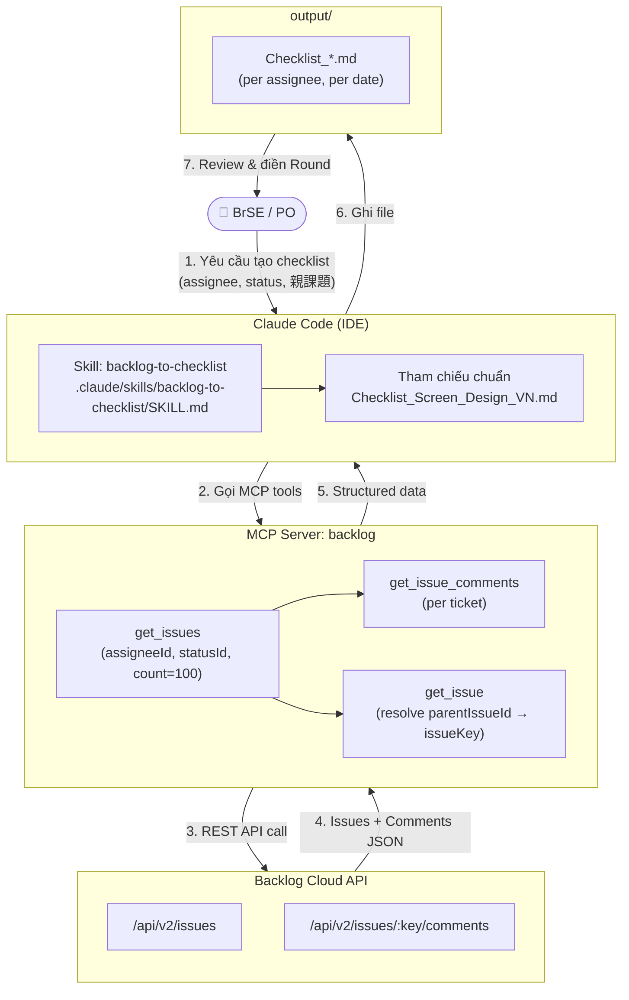

# ToolAI-Checklist

Tool tự động hóa việc biến comment khách hàng Nhật trên **Backlog** thành **Design Review Checklist** theo từng ticket — chạy bằng Claude Code + MCP server backlog.

---

## Architecture



---

## Luồng xử lý (6 bước)

| Bước | Mô tả |
|------|-------|
| **1. Thu thập** | `get_issues` với `assigneeId` + `statusId` + `count=100` (pagination nếu ≥100) |
| **2. Lọc** | Chỉ giữ comment thiết kế của khách, bỏ log trạng thái rỗng |
| **3. Nhóm** | Gom comment theo từng ticket (`issueKey`); resolve `parentIssueId` → nhãn 親課題 |
| **4. Chuyển đổi** | Mỗi ý độc lập → 1 dòng checklist (mệnh lệnh rõ việc, không viết câu hỏi) |
| **5. Xuất** | 1 file Markdown trong `output/`, tách theo 親課題 + từng ticket |
| **6. Cộng dồn** | Lần sau chỉ thêm comment mới, giữ nguyên cột Round designer đã điền |

---

## Cấu trúc thư mục

```
ToolAI-Checklist/
├── .claude/
│   └── skills/
│       └── backlog-to-checklist/
│           ├── SKILL.md                    # Định nghĩa skill + quy trình
│           └── Checklist_Screen_Design_VN.md  # Bộ category chuẩn (tham chiếu)
├── output/
│   └── Checklist_<loại>_<assignee>_YYYY-MM-DD.md
├── .gitignore
└── README.md
```

---

## Quy tắc quan trọng

- **Cột "Việc cần sửa"** luôn là mệnh lệnh rõ việc — KHÔNG viết câu hỏi (`...chưa?`, `...không?`)
- **Lọc assignee** dùng `assigneeId=[id số]` — KHÔNG dùng `keyword` (chỉ tìm trong tiêu đề ticket)
- **親課題 grouping** — mỗi ticket hiển thị parent issue; sắp xếp output theo nhóm parent
- **Mandatory (M)** — chỉ đánh khi khách dùng từ mạnh: 必須 / 必ず / 絶対 / "bắt buộc"
- **Không sửa Backlog** — chỉ đọc, không ghi/sửa/xóa comment khách

---

## Thông tin dự án (POS UI)

| | |
|---|---|
| Project | POS_UI (`id: 745282`) |
| VTI アイン assigneeId | `2045991` |
| Status 差戻 | `id: 379481` |
| Output mới nhất | `output/Checklist_DaModoshi_VTI_アイン_2026-05-24.md` (45 tickets, ~196 items) |
